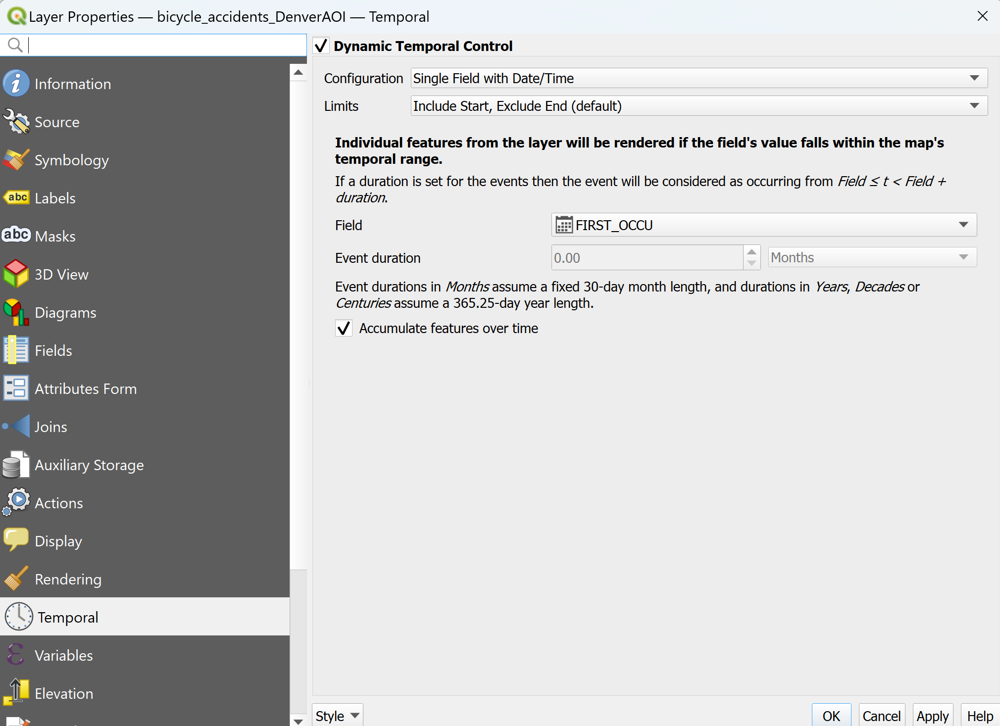
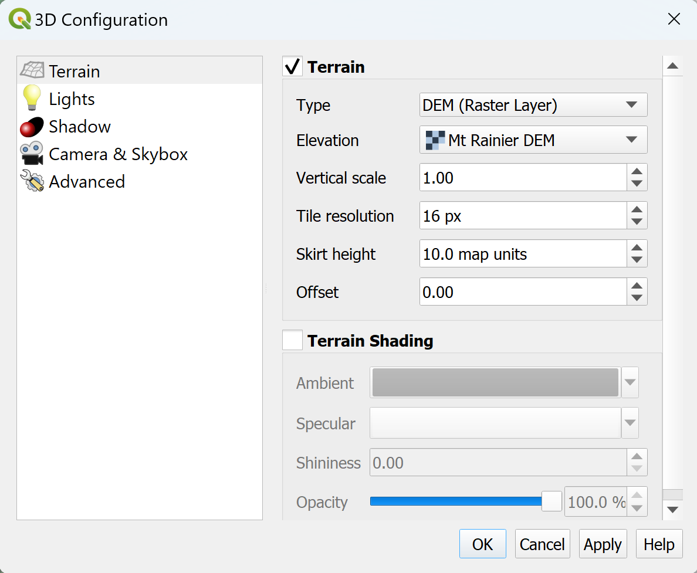

# Introducing the opensource software QGIS - Advanced Visualizations


In this mini-module, we'll work with some core plugins that are integrated into the software: The Temporal Controller and the 3D Viewer


### Materials
 - Projects: We'll work in the Denver Project and open a new project Mt_Rainier.qgz file
 - Data: available in [DenverData](https://www.dropbox.com/scl/fo/7u7ul2o5oqmgwq5q3xxs0/h?rlkey=5zmobslh1mxv01a64nc4jalbn&dl=0) (which you already have) and [MtRainier](https://www.dropbox.com/scl/fo/6h1p44csoy5hwgxfnh8e4/h?rlkey=mjic8b89121x54e4tgu3g9m32&dl=0) dropboxes.

QGIS has built-in capability to do some pretty wonderful things with data visualization. One of these is the ability to create animations with any data layer that has a date field. Another is visualizing 3D data, whether it is in the form of point clouds, DEMs or mesh files. We'll play with both of these capabilities briefly in this module.

### Sections
- [Temporal Controller](#time)
- [3D Visualization](#3d)


## <a name="time"></a>  Animations with the Temporal Controller

In order to use Temporal Control, we need to have a dataset that has a field with time information. Our bicycle accident dataset is a subset of traffic accident data from the Denver police (also from the Denver Open Data portal) that has the dates recorded along with a lot of other information. Open up its attribute table to find which field makes sense to use: FIRST_OCCU

You can also find the time range of the data (we'll need this!) by clicking on that field header which toggles the sorting back and forth from first to last. We'll see that this data extends from mid-September 2018 to mid-September 2023.

Click on the Temporal Controller panel icon in the Map Navigation Toolbar to open this dialog:

<p align="center">

</p>


Click on the fixed range temporal controller icon and then fill in the dates as seen below:

<p align="center">

</p>

Set the steps of the animation to 1 and month, click the play arrow and see what happens! The frames you see can be exported as .png files (use the export animation save icon at the far right) and then changed into a GIF with a tool like https://ezgif.com/maker.

Depending on whether we allow the points to accumulated, our animation will look quite different. We'll either see the bike-involved accidents that happen each month flash by, or they'll all accumulate. If we have the later, it would be nice to have some kind of symbolization by year of the accidents so we can keep better track of them.

1. Go to the Styling Dock with the bicycle_accidents_DenverAOI highlighted
1. Change the symbology from Single symbol to Categorized.
1. For the value for the categorization, open the expression option and enter ```year("FIRST_OCCU")``` This pulls the year information out of the full date.
1. Pick a graduated color ramp such as Blues
1. Classify

Before creating a final animation, think about what layers will provide the best context to bicycle accidents. I have the streets and the parks layer turned on. Also interesting would be to pull the bike routes layer from Denver Open Data and see how many of these accidents occurred on bike-declared routes or otherwise.


## <a name="3d"></a>  Viewing Mount Rainier in 3D

Creating a 3D view is quite a simple process as long as you have data in the right form. We're going to open the Mt_Rainier.qgz project, which already has a nicely styled DEM in a projected coordinate system that we'll be able to view in 3D.

Simply start by selecting *View* > *3D Map Views* > *New 3D Map View* :

<p align="center">

</p>

A new window with the view will pop up. But before we can see the mountain extend out of the ground, we need to configure our 3D viewer and tell it where to find the z-dimension information... in this case, in our DEM.

Click on the *Options* icon (looks like a little wrench) and select *Configure...*

<p align="center">

</p>

Choose the DEM (Raster) option and also pick the actual DEM file for the elevation information:

<p align="center">

</p>

Once the viewer knows where the elevation data is, you can use the controller arrows (or alternatively *Shift* + arrow keys) to navigate around Mt. Rainier. And similar to the Temporal Controller, you can work with Keyframes to create an animation.

<p align="center">

</p>
