# Introducing the opensource software QGIS - Cartography


### Materials
 - Software - access via the [QGIS download page](https://qgis.org/en/site/forusers/download.html)
 - Data - download from this dropbox [QGIS workshop data folder](https://www.dropbox.com/sh/3hxsx7vkv5mwy5e/AAAZWoctDaXnHgpebMdlBO62a?dl=0)


### Module Overview
In this module, we'll learn some cartography tricks, not only for our vector data, but also for labeling. We'll learn about some other methods on the way including a sneak peak at plugins so we can have a basemap. We'll wrap up with learning how to export printable maps.

### Module 2 Goals
This module will:
- Help us recreate an old-timey map style (almost)
- Introduce the processing toolbox
- Briefly introduce plugins
- Describe how to add CSV data
- Help us label our data
- Show us how to make a printable map


### Sections
- [Old-time map of states](#colorful)
- [Labeling 14er summits](#summits)
- [Print Composer](#print-composer)


# <a name="colorful"></a> Old-time map styling


<p align="center">
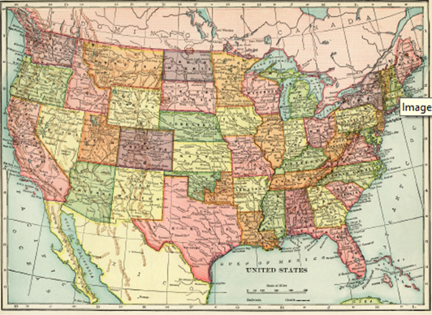
</p>

We're going to build up a map similar to what we see above using a tool for symbolizing categorical polygon colors (This little exercise is from a Kurt Menke workshop). But first, we need to set up our project for the U.S.:

Open a new qgis project
Change the CRS to EPSG 9311 (you'll notice the default is EPSG 4326). You can do this by going to *Project* > *Properties* and then choose the CRS option from the menu on the left. Search with "9311"
Add the USA.gpkg file to the layers menu
You'll see a pop-up asking which layers you'd like to add. Select the one that simply "states" and click *Add Layers*

### <a name="polygoncolors"></a>  Topological Coloring Tool

Now we're going to create that statesColored layer that you maybe didn't add using a fun tool from the processing tool box! That layer is there for you already as a backup.

The Topological Coloring Tool adds a new column with a color ID, but it does it in a smart way so that juxtaposed polygons have different colors!

1. Open the Processing Toolbox
1. Search for "Topological coloring" (or look directly under the *Cartography* section for it)
1. Double click on the tool to open it. A dialog box with information will pop up.
1. Use defaults
1. Select *Save to file* (or you will only be creating a temporary layer)

Now we can use this added column to do categorical symbolization of our states!

<p align="center">
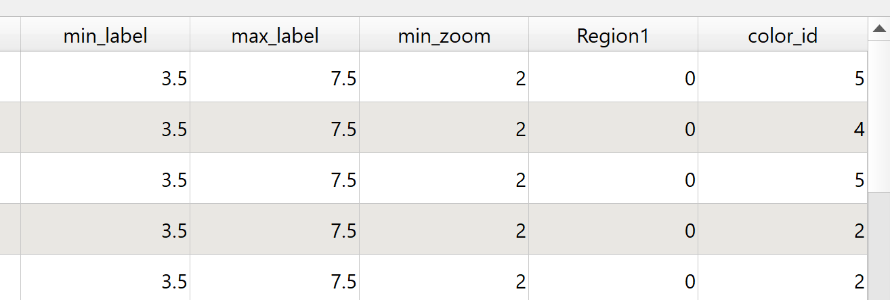
</p>

Open the Interactive Styling Dock
1. Open Styling Dock
1. Change to a Categorized renderer with Random colors
1. Use the *color_id* field
1. Hit Classify

<p align="center">
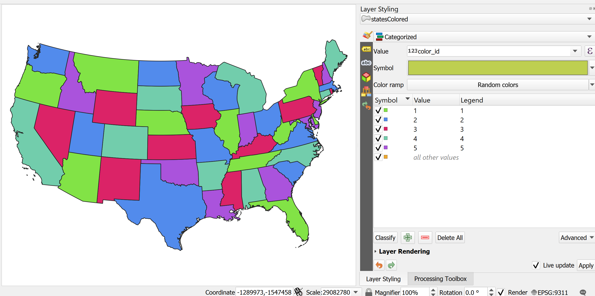
</p>

Shapeburst Fill
1. Duplicate the colored (statesColored) layer either with *Duplicate Layer* or Copy and Pasting layers with right clicking.
1. Turn off original states layer and turn on duplicated layer
1. Using the Styling Dock
1. From the dropdown by the *Symbol* bar, select *Configure Symbol*
1. Select Simple Fill
1. By the *Symbol layer type* dropdown, pick Shapeburst fill
1. Set to a Distance = 3
1. Set the 2nd Gradient Color to Transparent via the menu from the dropdown

<p align="center">
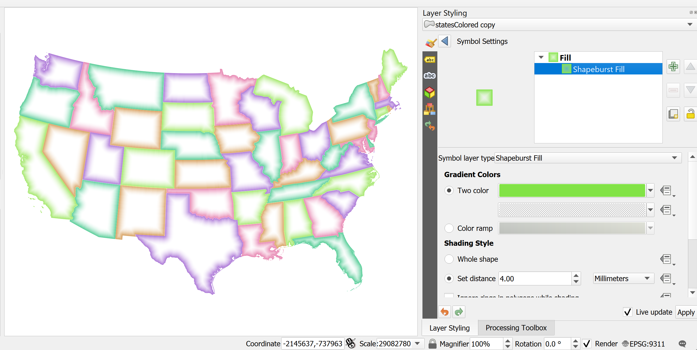
</p>

Add a base map!

To do this, we'll sneak into our Plugins meny and grab one called QuickMapServices.

1. Go to the *Plugins* menu and select *Manage and Install Plugins*
1. In the search bar, type in "QuickMapServices" and that plugin will appear
1. Select Install
1. Under the *Web* menu, find your new plugin option
1. Pick a basemap! (Google Roads is what I've used - it may be available in the base options of base maps)

<p align="center">
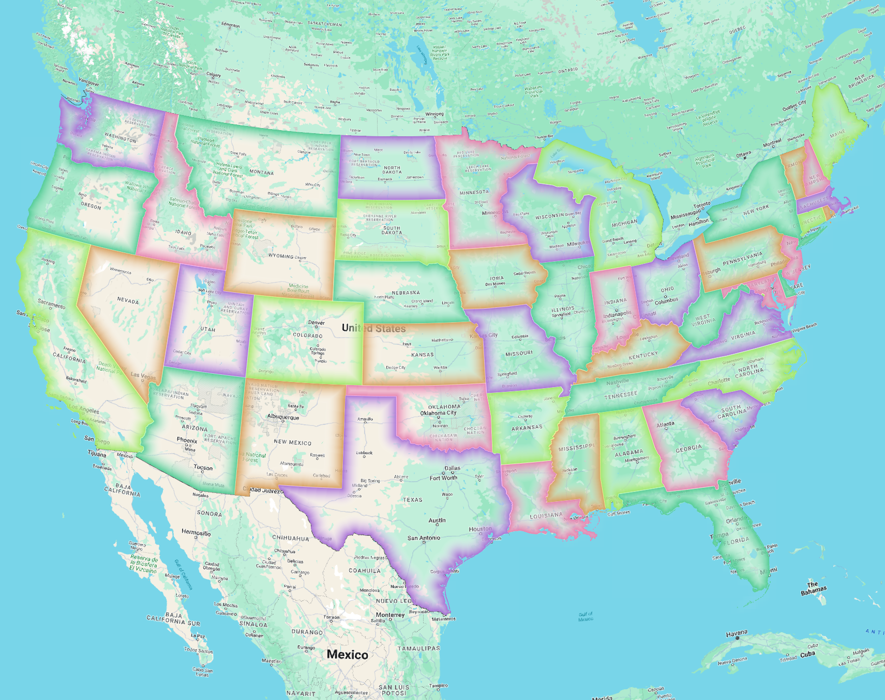
</p>

# <a name="summits"></a> Labeling & Symbolizing Summits

Now we're going to make a map of the 14ers in the state of Colorado and do some work with expressions for our symbology and labeling.

Start by opening up the prepared QGIS project:  StateOfColorado.qgz

(For it to open correctly, you need to make sure you've kept the source data in the same relative folder structure that was provided in the download.)

It should look like this:

<p align="center">

</p>

There's a lot going on in this project. Take some time to explore what's there before we add our 14er summits!

Our 14er data is in a CSV with latitude and longitude data, but QGIS can convert this to a point vector file for us - we just need to think about our CRS when we do this process.

Add CSV 14er data to our map
1. Open the data source manager (looks like three little cards, red, yellow and blue)
1. Select the *Deliminated Text* option
1. Add the file FourteenersCSV.csv from the downloaded data
1. You will be prompted to select the correct field for the X & Y coordinates
1. The CRS should be set to EPSG 4326 because our data is just lat/lon information

<p align="center">
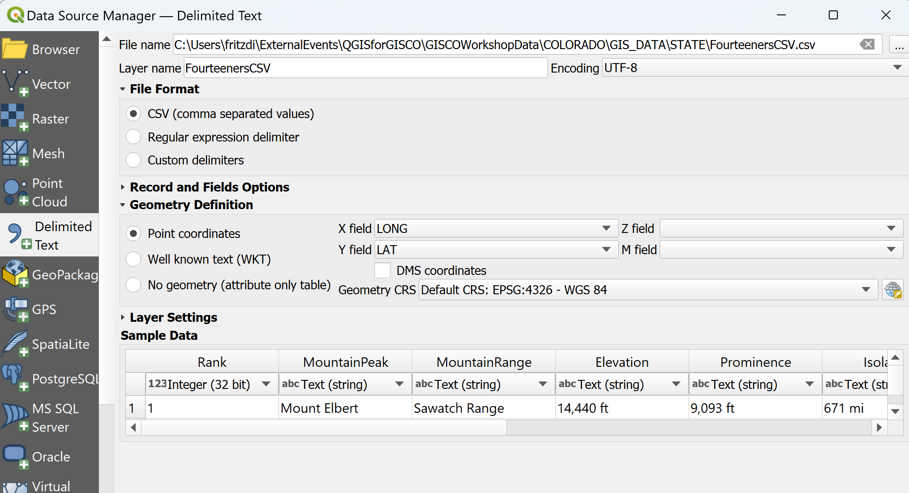
</p>

QGIS will bring in our 14er data as a point feature class, but we want to export it to a different layer with the project CRS.
1. Right click on FourteenersCSV and select *Export*
1. Happily, QGIS will "reproject" while creating a new feature class! Make the CRS EPSG 26913 to match the other data in the project.
1. Save the file as a .gpkg (like Colorado14ers.gpkg)

Now let's do something interesting with the summit symbols and labels!

Change the symbology to a triangle white marker:

<p align="center">
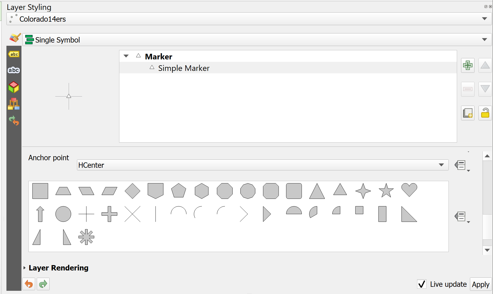
</p>

Click on the size data defined override button to the right and enter this code and hit OK:

```scale_linear("ELEVNUM", 14000, 14500, 3, 7)```


<p align="center">
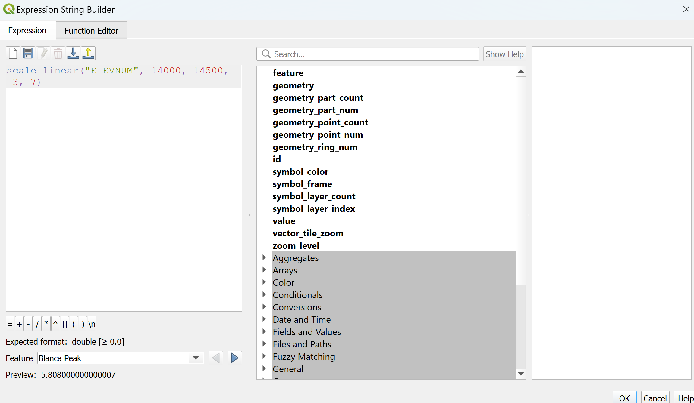
</p>

We'll now have our symbols proprotionately sized to how tall the peak is!

<p align="center">
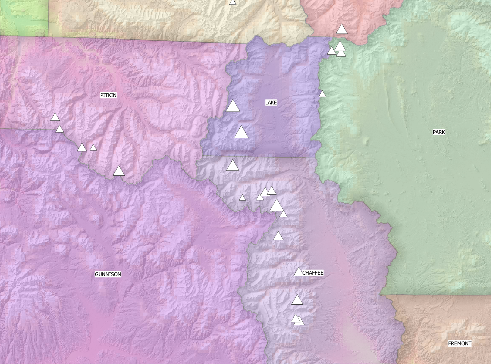
</p>

Now for some labeling!

- Toggle on the labels by right clicking on Colorado14ers and finding the labels option. You'll also be able to control the labels in the Styling Dock.
- Navigate to the labels dialog next to the Single label option, enter this expression: ```MountainPeak || '\n(' || elevation || ')'``` This will display a multi-line label.
- Navigate to the Placement tab (four arrows pointing all directions) and the Distance Data override and enter: ```1 + scale_linear("ELEVNUM", 14000, 14500, 3, 7)
/ 2.0``` This defines the distance between the peak data and the label.

<p align="center">
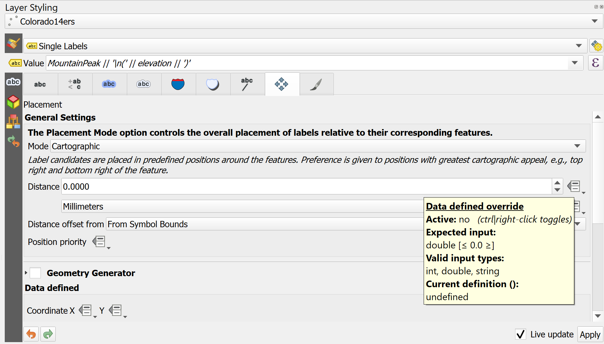
</p>

- Last but not least, we can add an expression that prioritizes where to place the labels in relation to the data points. Keep the placement as Cartographic and in the *Placement Priority* override enter: ```'B,BSR,BSL,BR,BL,R,L'``` Where B stands for bottom middle, BSR is bottom slightly right, BSL is bottom slightly left, BR is bottom right, and so on.

<p align="center">
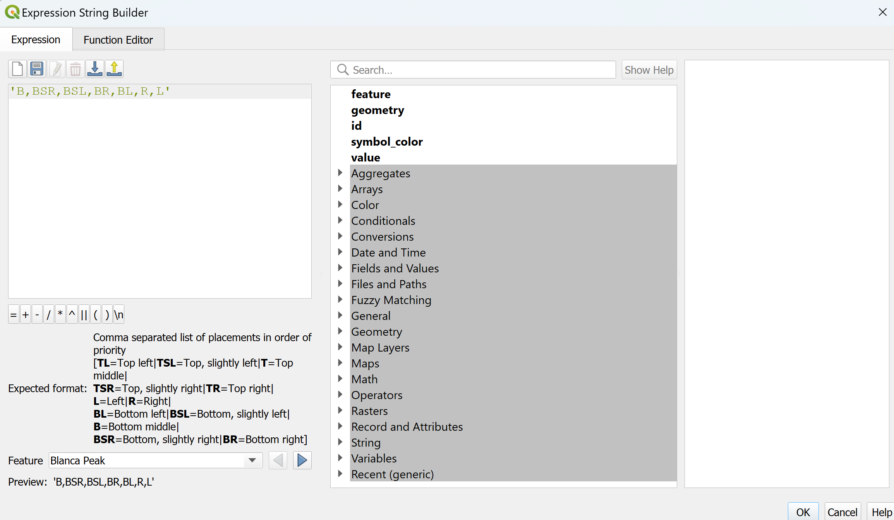
</p>

- You can also try scaling the font of the label with ```scale_linear("ELEVNUM", 14000, 14500, 10, 20)``` The flexibility is endless.

<p align="center">
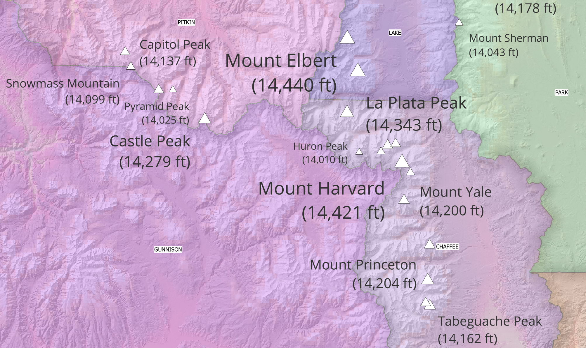
</p>

# <a name="print-composer"></a> Making a map with the print composer
So now that we've made a map in the software, how do we produce a map to include in a document or presentation?  In QGIS we create maps in the *Print Composer*.  Let's make a finished map of our 14er summits.

## Prepare your Layers
The first thing we need to do is add all the layers we want in our finished map to our Map Canvas in the main QGIS window.  Turn on any layers you want to appear on that map that will help the viewer understand your information.

Styling layers before creating a map demands consideration. Take some time to work with your layer symbology.  Make choices that you feel help communicate the data well.  Simple or plain choices are often better than complicated or fancy symbology.  For example, you could use a mountain-shaped icon to represent your summits, but this would probably make a rather busy map.  We've already made some proportionately sized simple icons.

Here you want to get to a point where you have a solid draft. You can go back and change details such as styling later and keep the same Print Composer to redo it... we'll see what that means in a minute.

## Working in the Print Composer
Once you've added all the layers you need to your Map Canvas and styled them in a way you like, you can start composing your map.

1. Open the *Print Composer* by clicking on the *Project* menu and choosing *New Print Layout*.
1. Give your new Print Layout a name. You can have multiple map layouts using the data in this map document, so pick a name that will remind you of the purpose of this map.  Click *OK* when you've picked a name. The *Print Composer* will now open.
1. The white box in the middle of the window is where you will compose your map.  Right click in this white space and choose *Page Properties* from the menu that appears.  The menu on the right will now let us adjust the page size and orientation.  Let's use size *Letter* and *Landscape* orientation for this map.  
1. Add a map to your layout by clicking the *Add Map* tool and then clicking and dragging on your map layout. 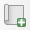  You can adjust the size so don't worry if it's not perfect at first.  The *Move Item* tool moves and adjusts items in your map.  
1. Adjust the scale of your map by selecting your map.  In the *Item Properties* on the right, adjust the scale number to zoom in or out of your map data.
1. Add other items to your map as needed: title, legend, scale bar, etc. The item properties for each item you add are available by selecting the item and editing the properties in the pane on the right side of the *Print Composer* window.
1. When you've made a layout you like, you can export the map to a variety of formats.  On the *Layout* menu, select *Save as Image*.  Navigate to where you would like to save the image, name the file, and choose the type of image such as .png.Click *Save*.
1. Make any adjustments to the image parameters you would like.  Click *Save* to finish the process.
1. When you're finished exporting your map, you can close the *Print Composer* window.

Now you've created this layout in the print composer, you can return to it and reuse it with different layers turned on and off, or with different styling. This is a great advantage for creating multiple maps of the same area with different information.
