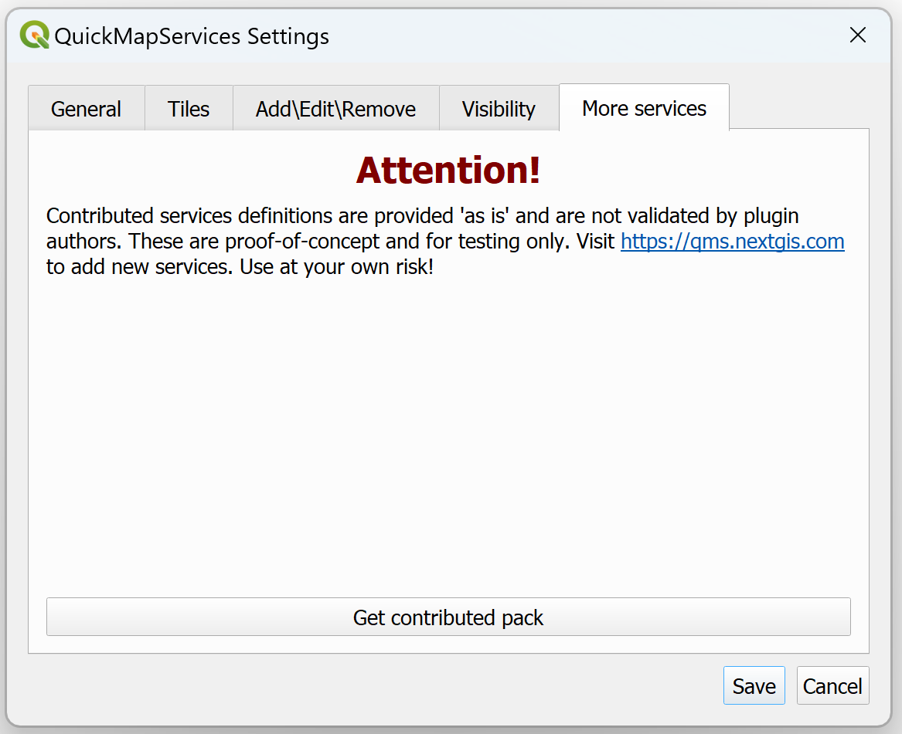
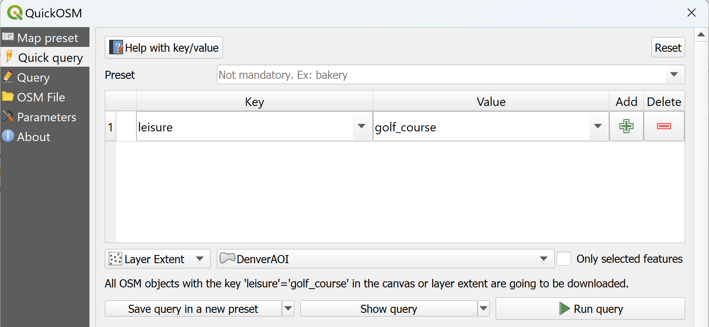
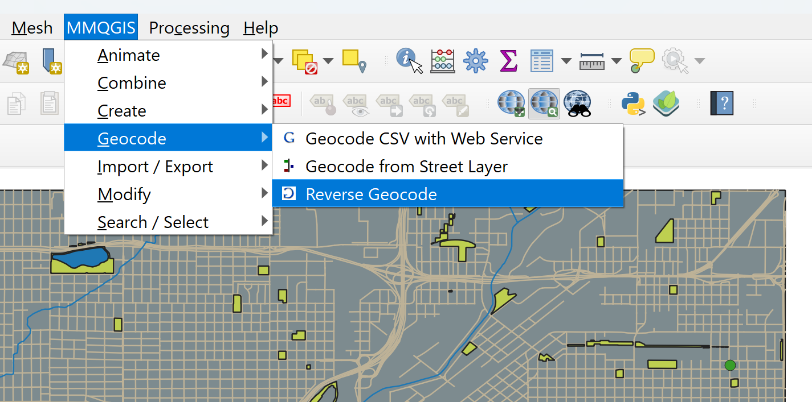
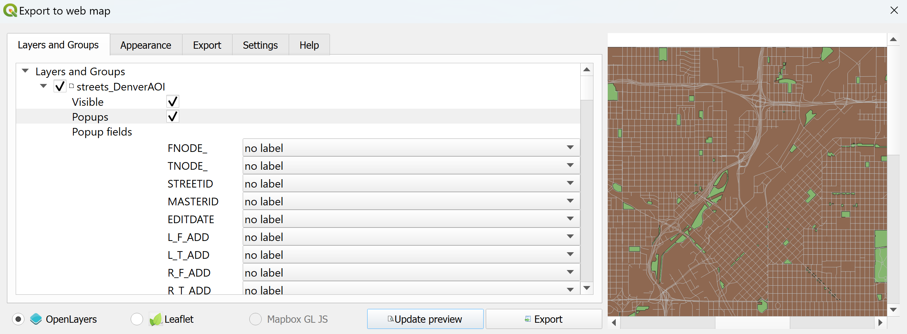
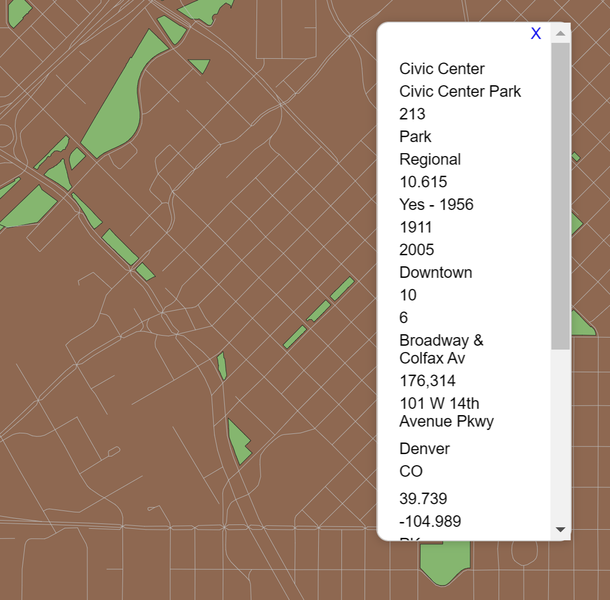

# Introducing the opensource software QGIS - Plugins


QGIS developers create plugins to add functionality. Core plugins come installed in the software. Others can be custom added from the menu.


### Materials
 - Projects: We'll go back to our Denver data for this module
 - Data: no new data needed

## Plugins - what are they?

- Plugins are addons that introduce new features or functions to
QGIS
- Implemented as either core or external plugins
- Adding, removing, activating and deactivating of external plugins are all
done through Plugins > Manage and Install Plugins ...
- Core Plugins (Installed) are developed by the QGIS dev team and are
included in distribution
- External Plugins or 3rd Party Plugins are stored in external repositories and maintained by authors
- Within the Plugin Manager under Settings, choose 'Check for
updates' on startup and then the frequency to keep them up to date

We will explore some plugins, including on that gives us access to base maps.

### Sections
- [How to use plugins](#plugins)
- [QuickMapServices](#quickmap)
- [QuickOSM](#quickosm)
- [MMQGIS](#mmqgis)
- [qgis2web](#qgis2web)

## <a name="plugins"></a>  How to use plugins

There is a candystore of plugins available under the 'Plugins' menu on the QGIS interface! Each one has a simple description of what they do, an indication if it is "experimental" or approved, and how many times each one has been downloaded so you can judge its popularity/usefulness.

Let's reopen our Denver Project to do some exploring.

Access plugins by the following:

- Ensure you are connected to the internet
- Go to *Plugins* > *Manage and Install Plugins*
- A new window will pop up. Select *All plugins* (You can change this to view just the ones you have installed)
- Use the search if you know the name of the plugin you want or just browse. Browsing can also be done directly on the web at [plugins.qgis.org/plugins/](https://plugins.qgis.org/plugins/)
- Once you've found a plugin you like, just click *Install*!


## <a name="quickmap"></a>  QuickMapServices
The QuickMapServices plugin gives you access to a number of basemaps from various providers. The default has a few minimal basemaps available, but it is possible to add more from contributers.

- Once you have installed the plugin (you'll find it under the Web menu), click on it and go to *Settings*
- Go to the *More Services* tab
- The warning lets you know that the options are not provided by the plugin developer, but there are options there that are useful.
- Click on *Get Contributed Pack*
- Recheck what basemaps are available to you!

<p align="center">

</p>


## <a name="QuickOSM"></a>  QuickOSM
First, to understand the power of this plugin, we need to know a little about what OSM is...

OpenStreetMap is the global geospatial database of the world created by volunteer mappers who add data that represents what exists on the ground to the project. Data is verified by a strong community of mappers that help each other develop good data schemas and mapping practices.

For further information that will help you be invovled in OSM and understand how this plugin can help you access this data see:

- To join the global project and edit: [openstreetmap.org](https://openstreetmap.org)
- To join the U.S. chapter and get involved in projects: [opentreetmap.us](https://openstreetmap.us)
- To learn the basic data structure: [map elements wiki page](https://wiki.openstreetmap.org/wiki/Elements)
- To understand the tagging schema: [map features wiki page](https://wiki.openstreetmap.org/wiki/Map_features)

### Pulling data from OpenStreetMap into QGIS

Let's say we want to get a point layer of all the golf courses in our Denver area. This is the kind of data likely to be well-mapped by OSM volunteers, so OpenStreetMap is a reasonable source for this information.

*Note: OSM is also an excellent data source for all kinds of data in countries that have a solid volunteer mapping community. Sometimes, OSM is the only source of more obscure data that is important to a small community, but may not be available through public sector portals.*

<p align="center">

</p>


## <a name="mmqgis"></a> MMQGIS

Another popular plugin that has been downloaded by many is MMQGIS by author Michael Minn (thus the MM). It includes many tools for manipulating vector layers in QGIS, including geocoding.

Geocoding! Yes, you can create points from addresses you have in a .csv or you can get addresses of points that you have. We're going to do the latter and find out which residences have the few weeping willows in our Denver study area.

First, we want to limit our Select trees data down to weeping willows and non-park trees, so we'll put on a definition query on our tree dataset.

Add the following to the query builder dialog under Source for the selected trees layer:

```"SPECIES_CO" = 'Willow, Weeping' AND "LOCATION_N" LIKE '%non-park%'```

Now we have a few trees that are located at residences and not in parks for which we can get the addresses of their caretakers.

1. Go to *MMGQIS* in the top menu bar and select *Geocoding* > *Reverse Geocode*
1. In the popup window, be sure your selected trees layer with the definition query is selected and change the web service from Google to OpenStreetMap / Nominatum.  (Note that this is an opensource geocoder that can't take a massive data call)
1. Pick a filename for the shapefile that will be produced with the address data attached to your trees in the attributes
1. Click *Apply* for the result - it may take a moment before it seems like it is processing.
1. Close the window once the process is complete.

<p align="center">


</p>

## <a name="qgis2web"></a> qgis2web

This plugin takes the styling of the data that you've done in QGIS and tranlates it connects / it through Leaflet and/or OpenLayers to create a webmap based on how you designed it on your desktop!

This is a complicated process as the plugin tries its best to conver all you have in your project to compatible renderers in either OpenLayers or Leaflet. For a truly simple example for an initial try open a new project and add only the following layers (adjust the colors as you'd like):
- DenverAOI
- parks_DenverAOI
- streets_DenverAOI

Once you've done that and added the qgis2web plugin, open the dialog from under the *Web* menu.

<p align="center">

</p>

Leave the defaults. Click *Update preview* and see if you can see a result in the window before trying *Export*. A successful export will create an html file of your interactive map with the attributes as pop-ups.

<p align="center">

</p>

