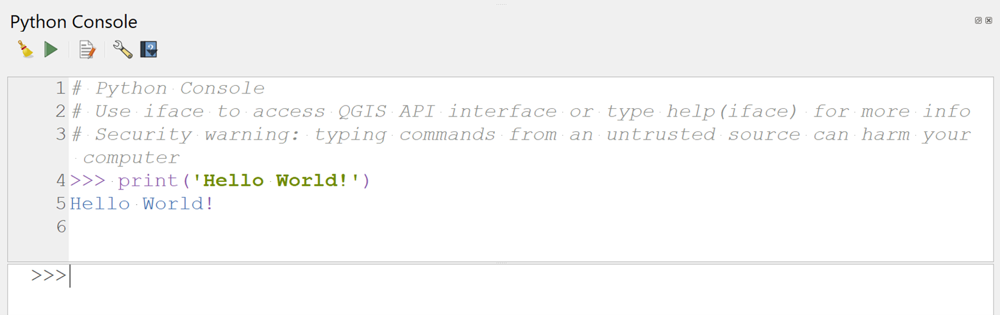
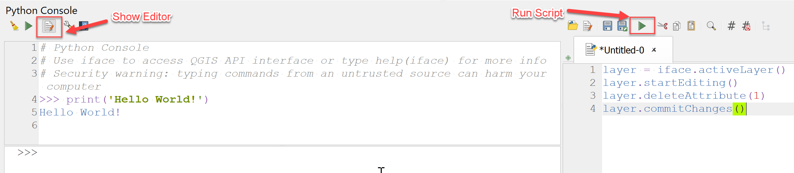

# Introducing the opensource software QGIS - Python


QGIS has a built-in Python console and code editor!

In this module, we'll meet PyQGIS: How to use it and a bit on how it works


### Materials
 - Project: Use the MtRainier.qgz file
 - Data: No new data needed

### Further Learning
- Master class by Ujuval Gandi, aka Spatial Thoughts (This module is a shortened version of his [PyQGIS masterclass](https://courses.spatialthoughts.com/pyqgis-in-a-day.html))


## Where can you use Python in QGIS?
- Issue commands from Python Console
- Automatically run python code when QGIS starts
- Write custom expressions
- Write custom actions
- Create new processing algorithms
- Create your own plugins!!!
- Create custom standalone applications

### Sections
- [Using the Console](#console)
- [Using the Editor](#editor)


## <a name="console"></a>  Using the Console
The python console is a built-in plugin that comes with the software. It has an immediate response to python commands that you can enter directly into QGIS.

Go to Plugins > Python Console

You'll see a window appear, likely docked at the bottom, with some helpful words about accessing the QGIS API via the iface class and some warnings. You'll also see a prompt like this: >>>

### Hello World (the classic print statement)

At the >>> prompt, type in the following command:

``` print('Hello World')```

You'll see the reponse immediately in the console after you hit enter. Of course you can enter any string you'd like to get the text returned in the console. It doesn't have to be "Hello World!"

<p align="center">

</p>

While console is useful for typing 1-2 lines of code or printing information contained in a variable, you should use the built-in editor for typing longer scripts or code snippets. Click the Show Editor button to open the editor panel. Enter the code and click the Run Script button to execute it. The results will appear in the console as before. If you are working on a longer script, you can also click the Save button in the editor to save the script for future use.

<p align="center">

</p>

## <a name="editor"></a>  Using the Editor

QGIS provides a Python API (Application Programming Interface), commonly known as PyQGIS. The API is extremely capable. Almost every operation that you can do using QGIS - can be done using the API. This allows developers to write code to build new tools, customize the interface and automate workflows.

### Simple Example
For an example on doing some data management with python, enter the following code into the code editor to delete the first field of a layer you have selected in the layers menu:

```
layer = iface.activeLayer()
layer.startEditing()
layer.deleteAttribute(1)
layer.commitChanges()
```

(To do the above process with the GUI, you would right click on your layer in the layers menu, open the attribute table, toggle on the editing mode in the attribute table window, select the Delete Field icon, then choose the name of the field you would like to delete and hit OK.)

Let’s understand the lines of code:

*layer = iface.activeLayer()*: This line uses the iface object and runs the activeLayer() method which returns the currently selected layer in QGIS. The method returns the reference to the layer which is saved in the layer variable.

*layer.startEditing()*: This is equivalent to putting the layer in the editing mode.

*layer.deleteAttribute(1)*: The deleteAttribute() is a method from QgsVectorLayer class. It takes the index of the attribute to be deleted. Here we pass on index 1 for the second attribute. (index 0 is the first attribute which is usually our ObjectID we want to keep)

*layer.commitChanges()*: This method saves the edit buffer and also disables the editing mode.


### Classes, objects and methods are all part of how PyGIS works!

Classes are templates for making modular code. PyQGIS has many, including QgsMapLayer() from which other classes are derived like QgsRasterLayer().Objects are instances of classes that are initiated with parameters. You can then call class functions using that object. Functions become methods when you call them using an object.

Let's take our data about cities in WA and delete the 3rd field for practice since all the cities are in WA and this column is likely unnecessary.

1. Make sure you have CitiesWA selected in the layers menu as the active layer
1. Right click on CitiesWA and open its attribute table to observe the data, then go ahead and close it.
1. Copy and paste the code above into the editor
1. Adjust the code as needed to delete the 3rd field from the attributes table. What do you need to change for this to work?
1. Hit the green arrow to run the four lines
1. Observe the change to the attribute table


### Running a Processing Algorithm via Python

Let's stick with our Mt. Rainer DEM from our 3D viewing exercise.

However for our code to work, you'll need to make a copy of mtrainerdem.tif in your computer folders and move it to the GISCOWorkshopData folder (or alternatively adjust the code to represent your pathway) and point to that .tif in your QGIS project.

Open a new project if you'd like. All you need to load is the ```mtrainierdem.tif.``` The code below will create a hillshade. You can use it in combination with a colored DEM to make a similar represention of the mountain that we had in our previous project.

Try to understand the parts of the code below. What class function is being called? How does code make our work more efficient?

```
import os
data_dir = os.path.join(os.path.expanduser('~'), 'Downloads', 'GISCOWorkshopData')

filename = 'mtrainierdem.tif'
dem = os.path.join(data_dir, filename)
iface.addRasterLayer(dem, 'dem', 'gdal')

results = processing.runAndLoadResults("native:hillshade", 
    {'INPUT': dem, 
    'Z_FACTOR':2,
    'AZIMUTH':300,
    'V_ANGLE':40,
    'OUTPUT': 'TEMPORARY_OUTPUT'})
```

